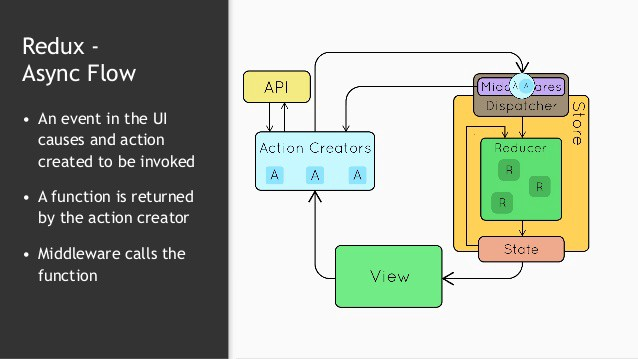
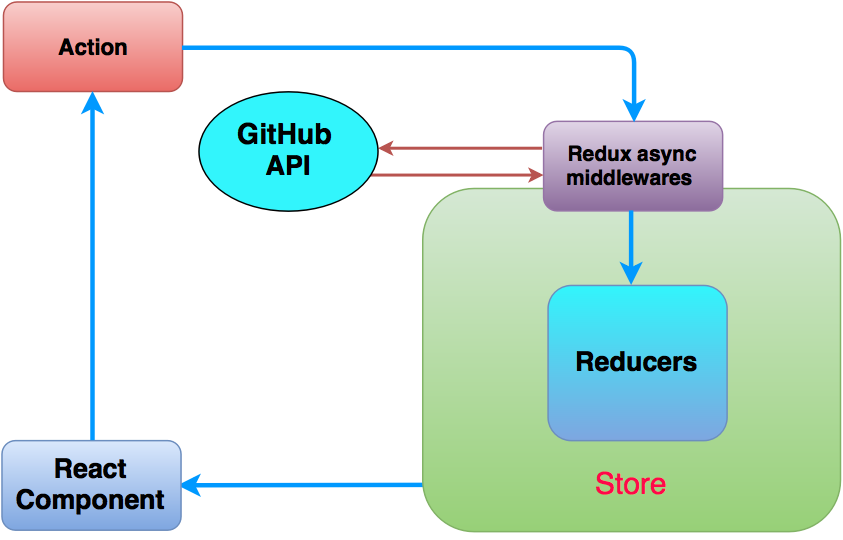

implented with no framework at all

is stated that Redux combines the ideas from:

- [The Command pattern]()
- [The Elm Architecture]()

using message-passing (also known as [event-driven programming](https://en.wikipedia.org/wiki/Event-driven_programming)) to manage application state

think of **state** as being in a **"predictable container"** that only changes as a reaction to these "events".

The nice part about this is not having to defensively check if anything has changed before processing interactions. Is there an alternative to this which doesn’t require being defensive on the interaction side?

# ref
- https://dev.to/davidkpiano/redux-is-half-of-a-pattern-1-2-1hd7?utm_source=Iterable&utm_medium=email&utm_campaign=the_overflow_newsletter&utm_content=01-23-20
- https://k94n.com/gordux-js-the-redux-pattern-in-vanilla-js

# Redux
- https://medium.com/@lavitr01051977/basic-react-redux-app-with-async-call-to-api-e478e6e0c48b
    - 

- https://hackernoon.com/handling-ajax-in-your-react-application-with-agility-413f1f21fc70
    - https://github.com/rowlandekemezie/Redux-saga-tutor
    - 

- https://dev.to/bouhm/react-redux-flow-terminologies-and-example-104b
    - 

- 

# CustomEvent 

- https://github.com/webmodules/custom-event