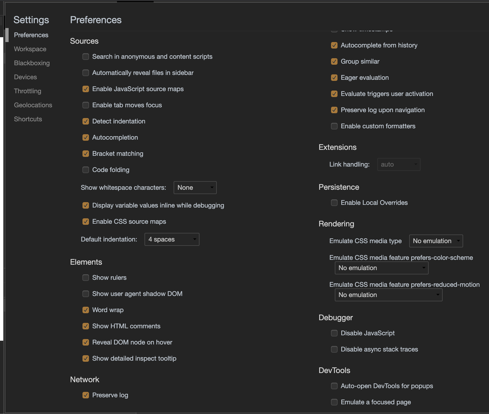

# [ita-webpack4-labs](https://github.com/rondinif/ita-webpack4-labs) > **lab-11**: ambiente di sviluppo - `source maps` con `expresse` e `webpack-dev-middleware`

## guida di riferimento
- https://webpack.js.org/guides/development/

# TODO
proviamo ad usare `express` come server di sviluppo ed facciamo are il lavoro che nella guida precedente ottenevamo dal `webpack-dev-server` con le "source-maps"

In pratico configuriamo il `webpack-dev-middleware` in modo che i files processati dal webpack vengano inviati al nostro speciale webserver che, in questo caso, sviluppiamo in `.src/server.js` grazie al noto [express](https://www.npmjs.com/package/express)

eseguire: 
``` bash 
$ npm run start-lab-11
```
express parte in ascolto sulla porta 3000 per cui occorre che questa porta sia disponibile per avviare questo processo;

## cosa osservare in questi esperimenti

si possono modificare i sorgenti ( es: il file `./src/lab-10/src/print.js`) e vedere che quando si salva il file viene automaticamente ricompilato il progetto e servito il nuovo bundle all'indirizzo `http://localhost:8080` aprendo questa URL con i Chrome dev tools ( cmd-alt-i (mac) o F12 (windows) si possono aprire i sorgenti e posiizinare breackpoints ed effettuare il debug direttamente in chrome. 

Gli strumenti di sviluppo di Chrome [chrome-devtools](https://developers.google.com/web/tools/chrome-devtools) supportano le `source maps`, che consentono di eseguire il debug del codice JavaScript traspilato come linguaggio sorgente originale. Questo vale per  TypeScript, CoffeeScript, ClojureScript o ECMAScript 6. Le `source maps` sono particolarmente utili perché è possibile posizionare punti di interruzione ( breakpoints ) , scorrere ed eseguire il debug dei sorgenti originali ( azichè dover andare sul trspilato che è piuttosto incomprensibile per il programmatore medio ). Assicurati di abilitare le `source maps` JavaScript e CSS selezionando l'opzione all'interno delle impostazioni dei chrome-devtools ( NB: non trovi queste opzioni tra i settings id chrome ma devi prima aprire i devtools ( cmd-alt-i o F12) e poi aprire i suoi settings )


## note
notare che gli esperimenti qui definiti **non** vengono eseguiti dal *task* generale di build: `npm --ignore-scripts=false run build` ma occorre eseguire il *task* specifico `npm run start-lab-11`

## per approfondimenti
- https://webpack.js.org/configuration/devtool
- [Hot Module Replacement guide](https://webpack.js.org/guides/hot-module-replacement/)
- https://webpack.js.org/configuration/mode/
- [chrome-devtools](https://developers.google.com/web/tools/chrome-devtools)
